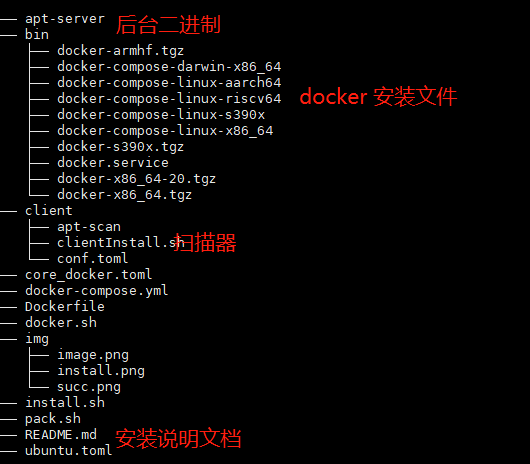
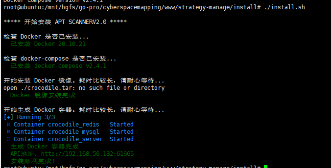
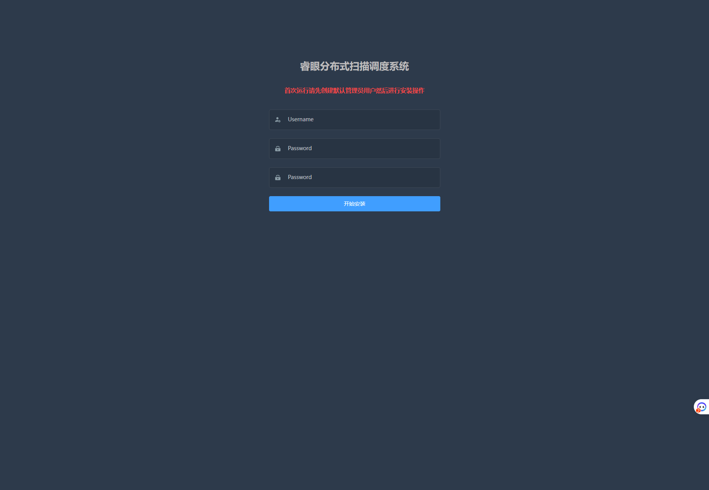

# 安装说明

## 后端准备（开发者）

### 前端  
npm  run build:prod

### go 资源编译

go-bindata -o=core/utils/asset/asset.go -pkg=asset web/crocodile/... sql

### go 编译服务端镜像
go build -o ./install/apt-server  main.go 

### go 扫描端
go build -o ../cyberspacemapping/www/strategy-manage/install/client/apt-scan main.go 

docker build -t hary654321/scaner . -f DockerfileScaner

### go 服务镜像  build   注意copy的分层  有缓存  可执行文件没有更新
docker build -t hary654321/crocodile . -f DockerfileServer

### 镜像打包

docker image save -o crocodile.tar hary654321/crocodile hary654321/scaner mysql:8.0 redis:3.2.10

### 客户端资源打包 

client 目录下

tar -cvf ./client.tar  *


### 一键生成安装包

./pack.sh

### 最终生成

install.tar

目录结构




## 安装步骤  （安装者）

### 1 代码执行
```
打包整个install 文件夹 上传到服务器 想要安装的目录
解压文件夹
tar -vxf install.tar
chmod +x install.sh
./install.sh

格式错误的话：   sed 's/\r//' -i install.sh 

```
安装完成后  展示访问地址



### 2 界面安装

进入界面




输入账号密码   （安装过程初始化数据库，添加管理员用户）


安装完成


### 初始化的数据

探针 


探针分组


###  部署扫描端（通过ssh 部署的也可以本地直接部署）

#### 本地部署

```
复制  client.tar 到/zrtx/apt
tar -vxf client.tar
./clientInstall.sh

完成安装
```

#### 服务端部署

新建主机为本机


点击部署


部署成功


##  说明
```
 docker 版本为 18.10.20


https://download.docker.com/linux/static/stable/   二进制的镜像资源


https://github.com/docker/compose/releases


//aarch64
docker-18.06.3-ce.tgz
```